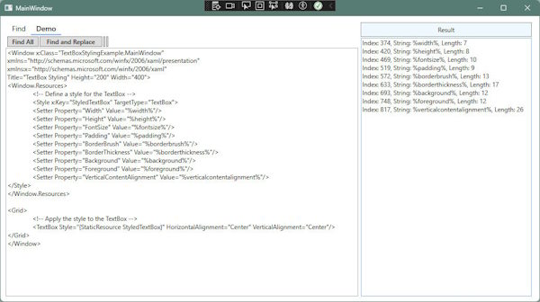

# EditableTextBox control

The EditableTextBox control should maybe be called the ExtendedTextBox control as there is no editing available per se, but offers ability to Find, Select and replace text from code.

The demo application provided showcases some of the features available.  It is a simple application written in C# WPF using Visual Studio 2022.

The EditableTextBox was created as a control to be included in an application I'm working on that required formatted strings, i.e. %example-string% embedded within the text that when parsed will be replaced with other data from a DataBase.

I got to looking at what could be done and the thing just snowballed into a very usable control.